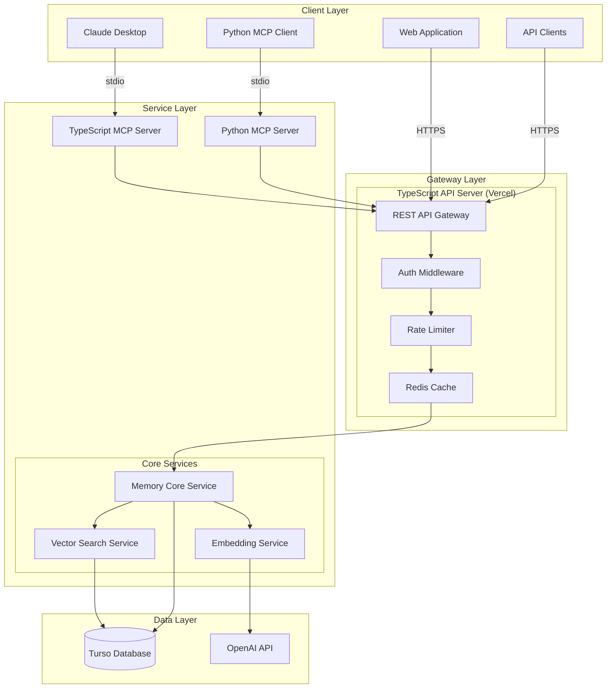
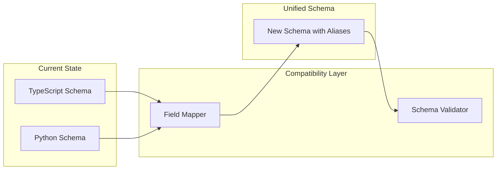
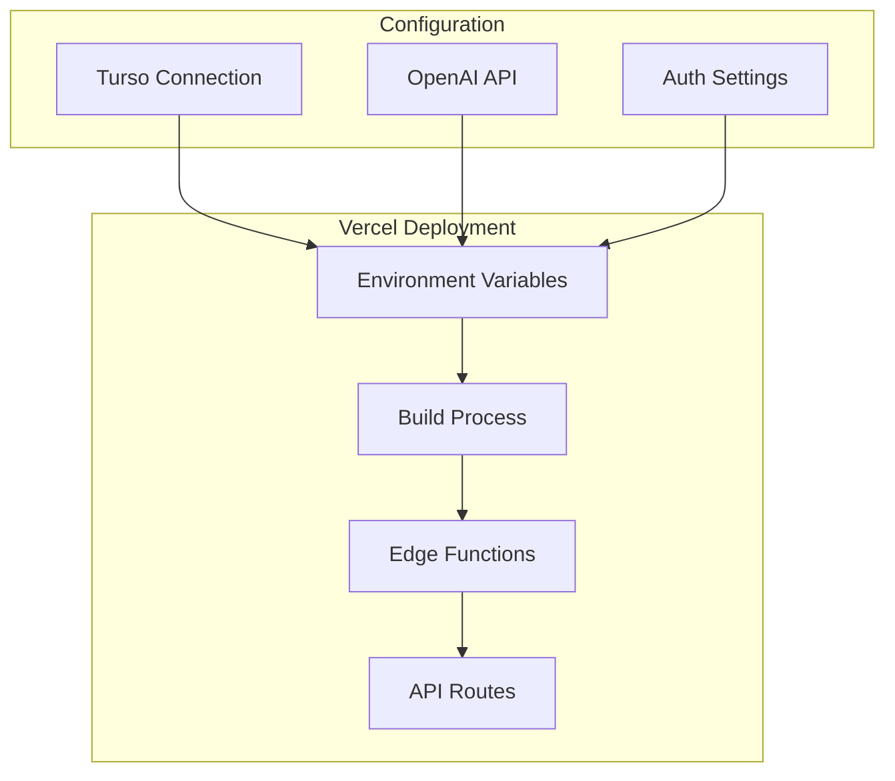
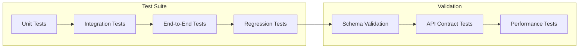
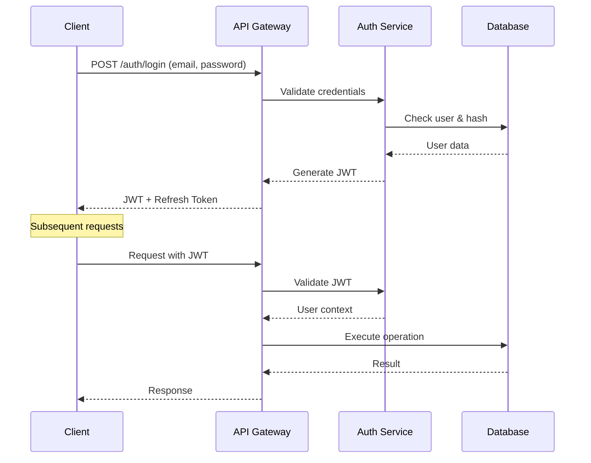
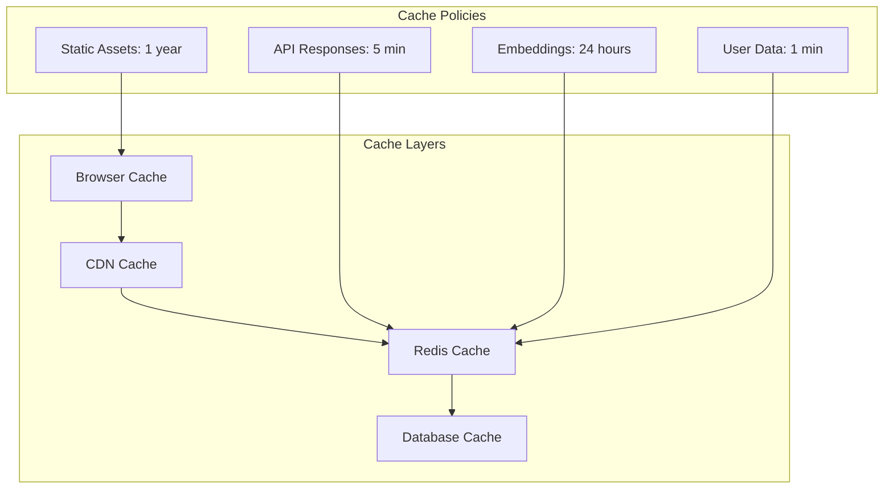
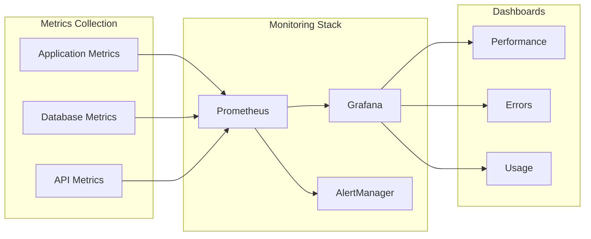
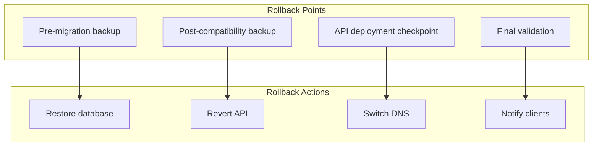

# Unified MCP Memory Architecture

## Executive Summary

This document outlines a unified architecture for the MCP Memory service that reconciles schema differences between the TypeScript and Python implementations, enabling both to share the same Turso database while maintaining backward compatibility.

## 1. Schema Differences Analysis

### Key Conflicts Identified

| Aspect | TypeScript | Python | Resolution |
|--------|------------|---------|------------|
| **Primary Keys** | TEXT (UUID) for memories | INTEGER AUTOINCREMENT | Use INTEGER with UUID fallback |
| **Field Names** | `title/content` | `description/details` | Unified naming with aliases |
| **API Keys** | Plaintext storage | SHA-256 hashed | Implement hashing in TypeScript |
| **User IDs** | TEXT (UUID) | TEXT (UUID) | ✅ Compatible |
| **Entity IDs** | INTEGER | INTEGER | ✅ Compatible |
| **Vector Storage** | TEXT (JSON array) | TEXT (JSON array) | ✅ Compatible |

### Database Column Mapping

```sql
-- Unified Schema
memories (
  id INTEGER PRIMARY KEY AUTOINCREMENT,
  uuid TEXT UNIQUE,  -- For backward compatibility
  user_id TEXT NOT NULL,

  -- Unified fields with backward compatibility
  title TEXT NOT NULL,        -- TypeScript field
  content TEXT NOT NULL,       -- TypeScript field
  description TEXT,            -- Python field (mirrors title)
  details TEXT,                -- Python field (mirrors content)

  memory_type TEXT NOT NULL,
  importance REAL DEFAULT 0.5,
  tags TEXT,                   -- JSON array
  entity_ids TEXT,             -- JSON array
  embedding TEXT,              -- JSON array (1536-dim vector)
  metadata TEXT,               -- JSON object

  created_at TEXT NOT NULL,
  updated_at TEXT NOT NULL,
  expires_at TEXT,
  is_archived BOOLEAN DEFAULT 0,
  active BOOLEAN DEFAULT 1
)
```

## 2. Unified Architecture Design



## 3. REST API Interface

### Unified API Endpoints

```typescript
// Base URL: https://api.mcp-memory.vercel.app/v1

interface UnifiedAPIEndpoints {
  // Authentication
  POST   /auth/login
  POST   /auth/refresh
  POST   /auth/logout

  // User Management
  GET    /users/me
  PUT    /users/me
  POST   /users/api-key/rotate

  // Memory Operations
  POST   /memories                    // Create memory
  GET    /memories                    // List memories
  GET    /memories/:id                // Get memory
  PUT    /memories/:id                // Update memory
  DELETE /memories/:id                // Delete memory
  POST   /memories/search              // Vector search
  POST   /memories/bulk                // Batch operations

  // Entity Management
  POST   /entities                    // Create entity
  GET    /entities                    // List entities
  GET    /entities/:id                // Get entity
  PUT    /entities/:id                // Update entity
  DELETE /entities/:id                // Delete entity
  GET    /entities/:id/memories       // Get entity memories

  // Interactions
  POST   /interactions                // Store interaction
  GET    /interactions                // List interactions
  GET    /interactions/stats          // Usage statistics

  // System
  GET    /health                      // Health check
  GET    /stats                       // System statistics
  POST   /embeddings/generate         // Generate embeddings
}
```

### API Response Format

```typescript
interface UnifiedResponse<T> {
  success: boolean;
  data?: T;
  error?: {
    code: string;
    message: string;
    details?: any;
  };
  meta?: {
    timestamp: string;
    version: string;
    requestId: string;
  };
}
```

## 4. Migration Strategy

### Phase 1: Schema Compatibility Layer (Week 1)



#### Implementation Steps:

1. **Add compatibility columns** to existing database:
```sql
-- Add missing columns without breaking existing data
ALTER TABLE memories ADD COLUMN description TEXT;
ALTER TABLE memories ADD COLUMN details TEXT;
ALTER TABLE memories ADD COLUMN uuid TEXT UNIQUE;

-- Create triggers for field synchronization
CREATE TRIGGER sync_memory_fields_insert
AFTER INSERT ON memories
BEGIN
  UPDATE memories
  SET
    description = NEW.title,
    details = NEW.content,
    uuid = CASE
      WHEN NEW.uuid IS NULL THEN
        lower(hex(randomblob(4)) || '-' || hex(randomblob(2)) || '-' ||
              hex(randomblob(2)) || '-' || hex(randomblob(8)))
      ELSE NEW.uuid
    END
  WHERE id = NEW.id;
END;

CREATE TRIGGER sync_memory_fields_update
AFTER UPDATE ON memories
BEGIN
  UPDATE memories
  SET
    description = COALESCE(NEW.title, NEW.description),
    details = COALESCE(NEW.content, NEW.details),
    title = COALESCE(NEW.title, NEW.description),
    content = COALESCE(NEW.content, NEW.details)
  WHERE id = NEW.id;
END;
```

2. **Implement field mapping in TypeScript**:
```typescript
// src/database/compatibility.ts
export class SchemaCompatibility {
  static mapMemoryFields(data: any): any {
    return {
      ...data,
      // Map Python fields to TypeScript
      title: data.title || data.description,
      content: data.content || data.details,
      // Map TypeScript fields to Python
      description: data.description || data.title,
      details: data.details || data.content,
    };
  }

  static mapEntityFields(data: any): any {
    // Entities are mostly compatible
    return data;
  }
}
```

3. **Fix API key security issue**:
```typescript
// src/utils/crypto.ts
import { createHash } from 'crypto';

export class ApiKeySecurity {
  static hashApiKey(apiKey: string): string {
    return createHash('sha256').update(apiKey).digest('hex');
  }

  static verifyApiKey(apiKey: string, hash: string): boolean {
    return this.hashApiKey(apiKey) === hash;
  }

  static generateApiKey(): string {
    return `mcp_${crypto.randomBytes(32).toString('hex')}`;
  }
}
```

### Phase 2: API Gateway Deployment (Week 2)



#### Vercel Deployment Configuration:

```json
// vercel.json
{
  "version": 2,
  "builds": [
    {
      "src": "dist/api/server.js",
      "use": "@vercel/node"
    }
  ],
  "routes": [
    {
      "src": "/api/(.*)",
      "dest": "/dist/api/server.js"
    }
  ],
  "env": {
    "TURSO_URL": "@turso-url",
    "TURSO_AUTH_TOKEN": "@turso-auth-token",
    "OPENAI_API_KEY": "@openai-api-key",
    "JWT_SECRET": "@jwt-secret",
    "REDIS_URL": "@redis-url"
  },
  "regions": ["iad1"],
  "functions": {
    "dist/api/server.js": {
      "maxDuration": 30
    }
  }
}
```

### Phase 3: Python MCP Migration (Week 3)

```python
# src/core/api_client.py
import httpx
from typing import Optional, Dict, Any

class UnifiedAPIClient:
    """Client for accessing TypeScript API from Python MCP server"""

    def __init__(self, base_url: str, api_key: str):
        self.base_url = base_url
        self.client = httpx.AsyncClient(
            headers={
                "Authorization": f"Bearer {api_key}",
                "Content-Type": "application/json"
            }
        )

    async def store_memory(self, memory_data: Dict[str, Any]) -> Dict[str, Any]:
        """Store memory via API instead of direct database access"""
        # Map Python fields to unified API format
        unified_data = {
            "title": memory_data.get("description", memory_data.get("title")),
            "content": memory_data.get("details", memory_data.get("content")),
            "memoryType": memory_data.get("memory_type"),
            "importance": memory_data.get("importance", 0.5),
            "tags": memory_data.get("tags", []),
            "metadata": memory_data.get("metadata", {})
        }

        response = await self.client.post(
            f"{self.base_url}/api/v1/memories",
            json=unified_data
        )
        response.raise_for_status()
        return response.json()

    async def search_memories(self, query: str, limit: int = 10) -> list:
        """Search memories via API"""
        response = await self.client.post(
            f"{self.base_url}/api/v1/memories/search",
            json={"query": query, "limit": limit}
        )
        response.raise_for_status()
        return response.json()["data"]
```

### Phase 4: Testing & Validation (Week 4)



## 5. Security Improvements

### API Key Management

```typescript
// Secure API key rotation
interface ApiKeyRotation {
  oldKeyGracePeriod: 3600; // 1 hour grace period
  keyFormat: "mcp_[32-byte-hex]";
  hashAlgorithm: "sha256";
  storage: "hashed-only";
}
```

### Authentication Flow



## 6. Data Consistency Strategy

### Transaction Management

```typescript
class TransactionManager {
  async executeWithRetry<T>(
    operation: () => Promise<T>,
    maxRetries: number = 3
  ): Promise<T> {
    for (let i = 0; i < maxRetries; i++) {
      try {
        return await this.db.transaction(async (tx) => {
          return await operation();
        });
      } catch (error) {
        if (i === maxRetries - 1) throw error;
        await this.delay(Math.pow(2, i) * 1000); // Exponential backoff
      }
    }
  }
}
```

### Conflict Resolution

```typescript
interface ConflictResolution {
  strategy: "last-write-wins" | "merge" | "prompt-user";
  timestampField: "updated_at";
  versionField: "version";
  mergeRules: {
    memories: "merge-metadata";
    entities: "last-write-wins";
    interactions: "append-only";
  };
}
```

## 7. Performance Optimization

### Caching Strategy



### Query Optimization

```sql
-- Optimized indexes for common queries
CREATE INDEX idx_memories_user_type ON memories(user_id, memory_type);
CREATE INDEX idx_memories_importance ON memories(user_id, importance DESC);
CREATE INDEX idx_entities_user_type ON entities(user_id, entity_type);
CREATE INDEX idx_entities_name ON entities(user_id, name);

-- Full-text search optimization
CREATE VIRTUAL TABLE memories_fts USING fts5(
    title, content, tags,
    tokenize='porter unicode61'
);
```

## 8. Monitoring & Observability



## 9. Deployment Timeline

| Week | Phase | Tasks | Deliverables |
|------|-------|-------|--------------|
| 1 | Schema Compatibility | • Add compatibility columns<br>• Implement field mapping<br>• Fix security issues | Compatible database schema |
| 2 | API Gateway | • Deploy to Vercel<br>• Configure edge functions<br>• Setup monitoring | Live API endpoint |
| 3 | Python Migration | • Implement API client<br>• Update MCP server<br>• Test integration | Updated Python MCP |
| 4 | Testing & Launch | • Run test suite<br>• Performance testing<br>• Documentation | Production release |

## 10. Rollback Strategy



### Rollback Procedures:

1. **Database Rollback**:
   - Keep backup of current schema
   - Maintain compatibility views
   - Use blue-green deployment

2. **API Rollback**:
   - Vercel instant rollback
   - Keep previous version active
   - DNS-based switching

3. **Client Rollback**:
   - Version-specific endpoints
   - Graceful degradation
   - Backward compatibility

## Conclusion

This unified architecture provides:

1. **Complete backward compatibility** - Both projects can operate during migration
2. **Enhanced security** - Fixes plaintext API key vulnerability
3. **Improved performance** - Centralized caching and optimization
4. **Better maintainability** - Single source of truth
5. **Scalability** - Vercel edge deployment
6. **Cost efficiency** - Shared infrastructure

The phased approach ensures zero downtime and allows for gradual migration with rollback capabilities at each stage.